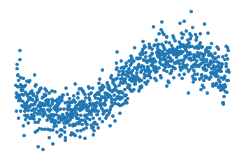
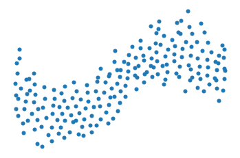

=========
vc sample
=========

Our void-and-cluster method (https://arxiv.org/abs/1907.05073) was designed to perform
*optimally stratified* sampling of spatiotemporal scattered data in 2D and 3D. This repository contains an
easy to use and to extend prototype implementation in python.

This implementation is not restricted to spatiotemporal data. However, since the
sampling strategy is based on kernel density estimation, the curse of dimensionality will be problematic in higher dimensions. One goal of this prototype
is to explore stratification in higher dimensions.

Examples
===========

The original dataset is shown on the left and 20% of samples on the right:

Samples should be maximally pairwise distant, whilst still respecting
the density of data points. I.e. dense regions in the original data are
sampled more often.
