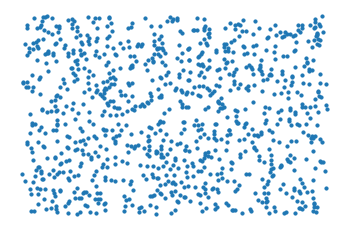
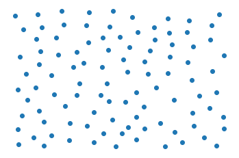
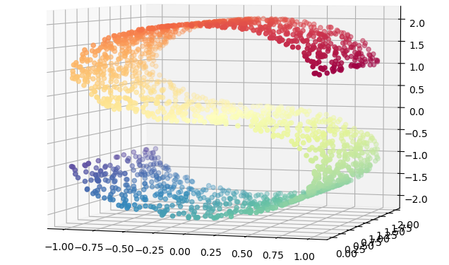
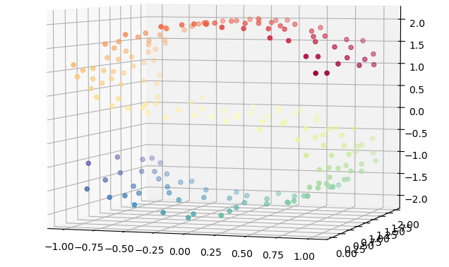

=========
vc sample
=========

Our void-and-cluster method (https://arxiv.org/abs/1907.05073) was designed to perform
*optimally stratified* sampling of spatiotemporal scattered data in 2D and 3D. This repository contains an
easy to use and to extend prototype implementation in python.

This implementation is not restricted to spatiotemporal data. However, since the
sampling strategy is based on kernel density estimation, the curse of dimensionality will be problematic in higher dimensions. One goal of this prototype
is to explore stratification in higher dimensions.

Example
===========

This is a simple example of a two-dimensional point set from which we sample a subset
using vc sample:

   The original dataset

   10% of samples

Samples should be maximally pairwise distant, whilst still respecting
the density of data points. I.e. dense regions in the original data are
sampled more often.

Sampling in higher dimensions is problematic, due to the curse of dimensionality. However, in a lot of cases, our data is lower dimensional,
but is _embedded_ in a higher dimensional space.

For example, this S-curve is a 2D manifold (think of a deformed rectangle) that lies in a 3D space:

   2000 points on a 2D S-curve embedded in 3D.

To sample such a dataset, we _only_ have to change the density estimation. By specifying the density on the S-curve and not by taking
distances in 3D, the void and cluster algorithm be directly used without changes.

Here, we use the UMAP dimensionality reduction technique to define a density estimate and then sample correspondingly:

   200 stratified samples _on the S-curve_

Installation
===========

This project is still under development. For setting it up for development, `pyscaffold <https://pyscaffold.org/>` is used,
to simplify python packaging.

Clone the repo:
``
git clone git@github.com:TobiasRp/vc_sample.git
cd vc_sample
``

Optionally, create and initialize conda or another virtual python env. This is not included here. Then,
install pyscaffold and install `vc_sample` as an editable package including its dependencies.

``
pip install pyscaffold

pip install -e .
``

Now, `vc_sample` can be imported as any other python package.

Usage
===========

Example notebooks can be found in the notebooks folder. Start with `notebooks/sampling_examples`.
